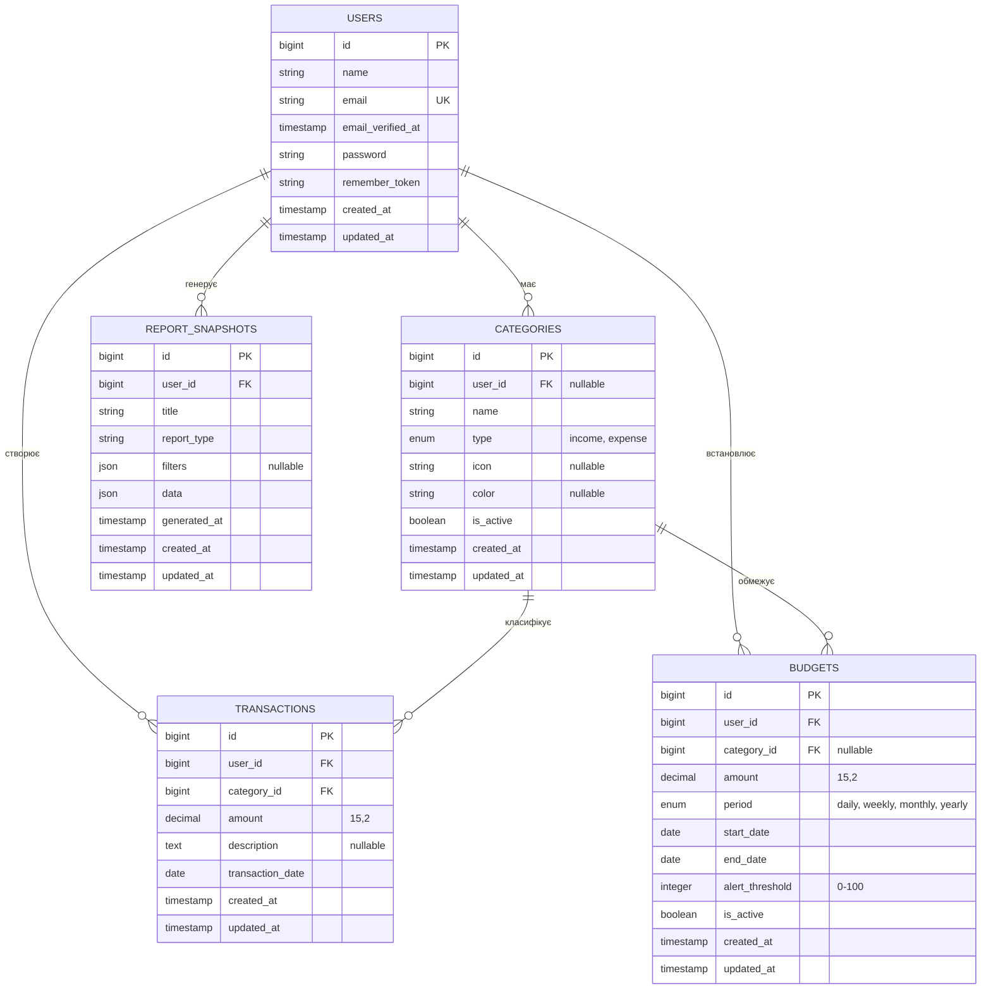

# ER-діаграма – Фінансовий трекер

## Примітки до діаграми

### Зв'язки (Cardinality):
- **User → Categories**: один користувач може мати багато категорій (1:N)
- **User → Transactions**: один користувач може створити багато транзакцій (1:N)
- **User → Budgets**: один користувач може встановити багато бюджетів (1:N)
- **User → ReportSnapshots**: один користувач може згенерувати багато звітів (1:N)
- **Category → Transactions**: одна категорія може мати багато транзакцій (1:N)
- **Category → Budgets**: одна категорія може бути у багатьох бюджетах (1:N)

### Каскадні дії:
- При видаленні `User`: видаляються всі пов'язані `Categories`, `Transactions`, `Budgets`, `ReportSnapshots`
- При видаленні `Category`: видаляються пов'язані `Budgets`; `Transactions` **не видаляються** (restrict)

### Індекси (для продуктивності):
- `users.email` (unique)
- `categories(user_id, type)`
- `transactions(user_id, category_id, transaction_date)`
- `budgets(user_id, category_id, start_date, end_date)`
- `report_snapshots(user_id, report_type, generated_at)`

### Особливості:
1. **Системні категорії**: `categories.user_id` nullable дозволяє створювати глобальні категорії для всіх користувачів
2. **Загальні бюджети**: `budgets.category_id` nullable дозволяє встановити ліміт на всі витрати без прив'язки до категорії
3. **JSON-поля**: `report_snapshots.filters` та `data` зберігають складні структури для кешування звітів

---

## Візуалізація у Mermaid Live Editor
Скопіюйте блок коду Mermaid та відкрийте у [Mermaid Live Editor](https://mermaid.live) для інтерактивного перегляду.
